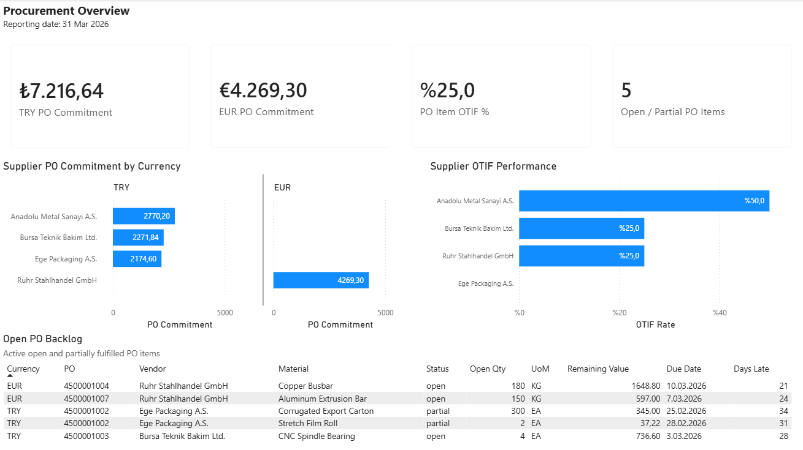
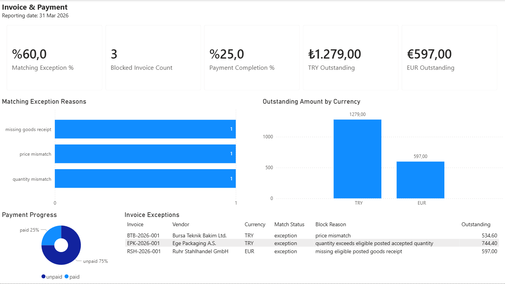
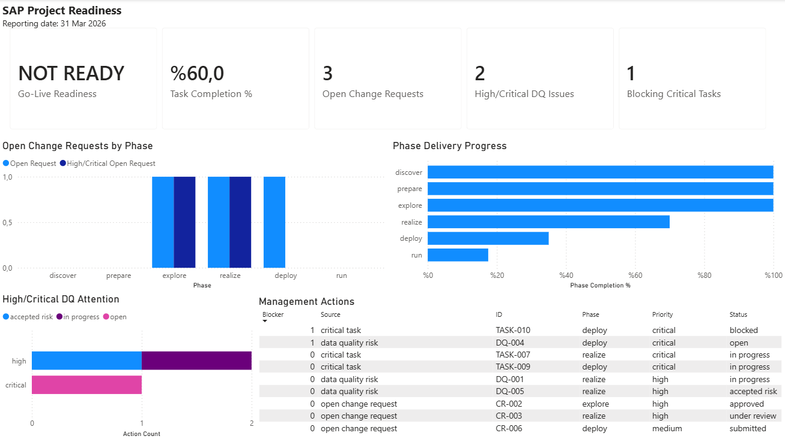

# SAP Activate ERP Procurement Analytics

Portfolio project combining procure-to-pay process modeling, deterministic synthetic ERP data, SQLite, SQL analytics, Python validation, Power BI, and SAP Activate project-readiness reporting.

**Python · SQLite · SQL · Power BI · SAP Activate**

## Dashboard Preview

### Procurement Overview



### Invoice & Payment



### SAP Project Readiness



The Power BI report is also available as an optional [downloadable PBIX artifact](dashboard/sap_activate_procurement_analytics.pbix). See the [dashboard guide](dashboard/README.md) for the model, relationships, measures, and page definitions.

## Executive Seed-42 Snapshot

| KPI | Result |
| --- | ---: |
| PO Item OTIF | 25.0% |
| Three-Way Matching Exception Rate | 60.0% |
| Invoice Payment Completion | 25.0% |
| Open Change Requests | 3 |
| Go-Live Readiness | **NOT READY** |
| PO Commitment | TRY 7,216.64 / EUR 4,269.30 |
| Outstanding Invoice Amount | TRY 1,279.00 / EUR 597.00 |

Currency amounts are reported separately; TRY and EUR are never added together.

## Business Process

`PR → PO → Goods Receipt → Invoice → Payment`

## What the Project Demonstrates

- Relational ERP and procurement data modeling
- Deterministic synthetic data generation
- Procurement and supplier analytics
- Three-way matching and payment-progress analysis
- SAP Activate change, data-quality, and readiness reporting
- Standalone SQL analytics
- Power BI dashboard delivery
- Validation and reproducibility

## Architecture

```text
Python Generator
→ SQLite
→ Analytical Views
→ Standalone SQL Analytics
→ Dashboard CSV Export
→ Power BI
```

## Reproduce

Run from the repository root:

```bash
python scripts/generate_data.py --reset
python scripts/validate_sql_queries.py
python scripts/export_dashboard_data.py
```

## Repository Map

- [database/](database/) — SQLite schema and generated database location
- [sql/](sql/) — standalone analytics and query guide
- [dashboard/](dashboard/) — Power BI artifact, screenshots, data extracts, and build documentation
- [docs/](docs/) — business case, [data model](docs/data_model.md), [KPI catalog](docs/kpi_catalog.md), and [SAP Activate mapping](docs/sap_activate_mapping.md)
- [scripts/](scripts/) — deterministic generation, validation, and dashboard export

## Scope and Limitations

- Uses a fictional Marmara Components dataset.
- Has no live SAP connection.
- Does not claim to reproduce SAP S/4HANA internals.
- Uses the fixed reporting date `2026-03-31`.
