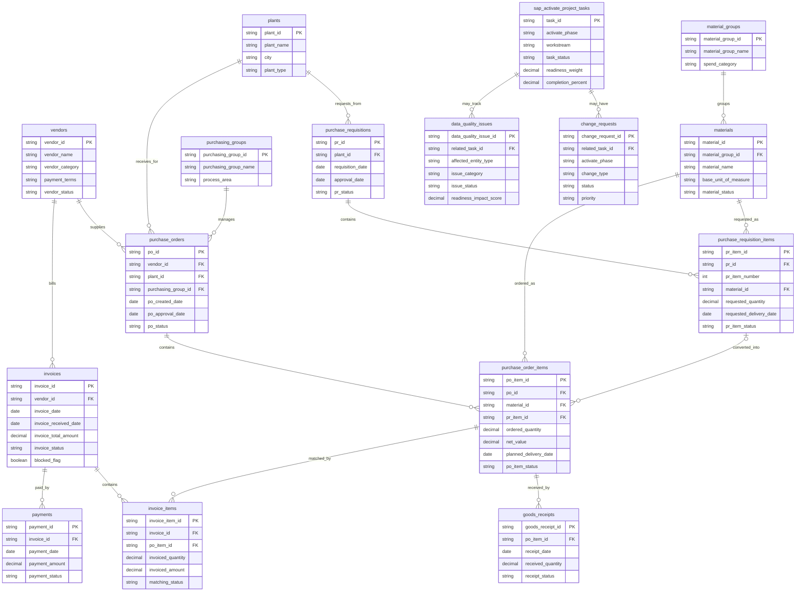

# Data Model

## 1. Purpose of the Data Model

This data model defines the planned analytical structure for the SAP Activate ERP Procurement Analytics project. The project simulates a procurement-focused SAP S/4HANA implementation scenario for Marmara Components, a fictional mid-sized manufacturing and industrial components company.

The model is designed for portfolio-ready SQL analytics, KPI calculation, and optional dashboard reporting. It does not connect to a real SAP system and it is not intended to reproduce the full SAP S/4HANA data model. Instead, it creates a realistic but manageable analytical layer around procurement transactions, supplier performance, invoice matching, open purchase order monitoring, data migration readiness, go-live readiness, and SAP Activate project tracking.

The executable SQLite schema is implemented in `database/schema.sql`. This document describes that current schema so that synthetic data generation, SQL queries, and dashboard outputs stay aligned with the business questions defined in the project.

## 2. Design Principles

| Principle | Explanation |
| --- | --- |
| Analytical first | Tables are designed to support SQL analysis and KPI reporting, not transactional SAP execution. |
| Simulation-oriented | Field names and relationships use realistic procurement terminology, but the model remains a simplified portfolio simulation. |
| Clear transaction grain | Important transaction tables have an explicit grain so KPI logic can be written consistently. |
| Spend at item level | `purchase_order_items` is the main spend grain because procurement value is usually analyzed at PO item, material, and category level. |
| End-to-end process visibility | The model supports the flow from requisition to purchase order, goods receipt, invoice, and payment. |
| Readiness tracking | Project tasks, change requests, and data quality issues are included so the analytics layer can support SAP Activate readiness questions. |
| SQL-friendly structure | The design avoids unnecessary complexity and is implemented in SQLite through `database/schema.sql`. |
| Portfolio clarity | The model should be understandable to recruiters, data analysts, SAP consultants, business analysts, and project managers. |

## 3. Entity Overview

| Entity | Type | Main Purpose |
| --- | --- | --- |
| `vendors` | Master data | Stores supplier information used for spend, delivery, invoice, and payment analysis. |
| `plants` | Master data | Represents company locations or plants where procurement demand and delivery activity occur. |
| `purchasing_groups` | Master data | Represents buyer teams or procurement ownership groups responsible for purchase orders. |
| `material_groups` | Master data | Groups materials into procurement categories for spend and category analysis. |
| `materials` | Master data | Stores material or service master records used on purchase order items. |
| `purchase_requisitions` | Transaction header | Captures internal purchase requests before conversion into purchase orders. |
| `purchase_requisition_items` | Transaction item | Captures line-level requested materials, quantities, and requested delivery dates. |
| `purchase_orders` | Transaction header | Captures supplier-facing purchasing documents linked to vendors, plants, and purchasing groups. |
| `purchase_order_items` | Transaction item | Main analytical spend grain; stores PO line values, quantities, materials, and delivery expectations. |
| `goods_receipts` | Transaction event | Stores receipt events against purchase order items for delivery and fulfillment analysis. |
| `invoices` | Transaction header | Stores supplier invoice header information, including status and blocked invoice indicators. |
| `invoice_items` | Transaction item | Stores invoice line details linked to invoices and purchase order items for matching analysis. |
| `payments` | Transaction event | Stores payment records linked to invoices for payment completion and timing analysis. |
| `sap_activate_project_tasks` | Project tracking | Tracks SAP Activate phase tasks, completion status, readiness weight, and progress. |
| `change_requests` | Project tracking | Tracks scope or requirement changes that may affect timeline, readiness, and project control. |
| `data_quality_issues` | Readiness tracking | Tracks data migration and data quality issues affecting master data, transactions, and go-live readiness. |

## 4. Detailed Table Descriptions

### `vendors`

Supplier master data for procurement analytics. This table supports vendor spend, supplier delivery performance, invoice exception analysis, and payment monitoring.

| Column | Description |
| --- | --- |
| `vendor_id` | Primary key for the supplier. |
| `vendor_name` | Supplier display name. |
| `country` | Supplier country or region. |
| `vendor_category` | Example categories such as raw material supplier, MRO supplier, service supplier, or logistics provider. |
| `payment_terms` | Planned payment terms, such as Net 30 or Net 60. |
| `preferred_vendor_flag` | Indicates whether the vendor is considered preferred for reporting and compliance analysis. |
| `vendor_status` | Controlled value: `active`, `inactive`, `blocked`, or `pending review`. |
| `created_date` | Date the synthetic vendor master record was created. |

### `plants`

Company plant or location master data. Plants are used to analyze procurement demand, open purchase orders, delivery delays, and operational ownership by location.

| Column | Description |
| --- | --- |
| `plant_id` | Primary key for the plant. |
| `plant_name` | Plant or location display name. |
| `city` | City where the plant is located. |
| `country` | Country where the plant is located. |
| `plant_type` | Controlled value: `manufacturing`, `distribution`, `service`, or `office`. |
| `plant_status` | Controlled value: `active`, `inactive`, or `planned`. |

### `purchasing_groups`

Procurement ownership group master data. This table supports analysis by buyer team, workload, purchase order cycle time, and open order follow-up.

| Column | Description |
| --- | --- |
| `purchasing_group_id` | Primary key for the purchasing group. |
| `purchasing_group_name` | Buyer group or procurement team name. |
| `manager_name` | Optional owner or manager for portfolio storytelling. |
| `process_area` | Controlled value: `direct materials`, `indirect materials`, `services`, or `mro`. |
| `status` | Controlled value: `active` or `inactive`. |

### `material_groups`

Material group master data for procurement category analysis. Material groups are used to analyze spend by category and supplier delivery performance by procurement segment.

| Column | Description |
| --- | --- |
| `material_group_id` | Primary key for the material group. |
| `material_group_name` | Category name such as raw materials, packaging, maintenance supplies, or services. |
| `category_owner` | Optional business owner for the category. |
| `spend_category` | Higher-level category used for dashboard grouping. |
| `status` | Controlled value: `active` or `inactive`. |

### `materials`

Material or service master data used on purchase order items. Materials connect procurement spend to material groups.

| Column | Description |
| --- | --- |
| `material_id` | Primary key for the material. |
| `material_group_id` | Foreign key to `material_groups`. |
| `material_name` | Material or service description. |
| `base_unit_of_measure` | Unit such as EA, KG, L, M, or HR. |
| `material_type` | Controlled value: `raw material`, `spare part`, `packaging`, `service`, or `consumable`. |
| `standard_price` | Optional reference price for synthetic data validation. |
| `material_status` | Controlled value: `active`, `inactive`, `blocked`, or `under review`. |

### `purchase_requisitions`

Purchase requisition header table. It represents internal demand before procurement creates or converts it into a supplier-facing purchase order.

| Column | Description |
| --- | --- |
| `pr_id` | Primary key for the purchase requisition header. |
| `plant_id` | Foreign key to `plants`. |
| `requester_name` | Person or department requesting the purchase. |
| `requisition_date` | Date the requisition was created. |
| `approval_date` | Date the requisition was approved, if applicable. |
| `pr_status` | Controlled value: `draft`, `submitted`, `approved`, `rejected`, `converted`, or `cancelled`. |
| `business_reason` | Short reason for the request. |

### `purchase_requisition_items`

Purchase requisition item table. It stores the line-level requested material, quantity, and requested delivery information. PR-to-PO conversion is represented from the `purchase_order_items` side through the optional `pr_item_id` field.

| Column | Description |
| --- | --- |
| `pr_item_id` | Primary key for the purchase requisition item. |
| `pr_id` | Foreign key to `purchase_requisitions`. |
| `pr_item_number` | Line number within the purchase requisition; unique together with `pr_id`. |
| `material_id` | Foreign key to `materials`. |
| `requested_quantity` | Requested quantity. |
| `requested_unit_price` | Estimated or expected unit price at requisition stage. |
| `requested_delivery_date` | Date requested by the business. |
| `pr_item_status` | Controlled value: `open`, `approved`, `converted`, `rejected`, `cancelled`, or `partially converted`. |

### `purchase_orders`

Purchase order header table. It represents supplier-facing purchasing documents and connects vendors, plants, and purchasing groups.

| Column | Description |
| --- | --- |
| `po_id` | Primary key for the purchase order header. |
| `vendor_id` | Foreign key to `vendors`. |
| `plant_id` | Foreign key to `plants`. |
| `purchasing_group_id` | Foreign key to `purchasing_groups`. |
| `po_number` | Human-readable synthetic purchase order number. |
| `po_created_date` | Date the purchase order was created. |
| `po_approval_date` | Date the purchase order was approved or released. |
| `document_currency` | Currency used for the purchase order. |
| `po_status` | Controlled value: `open`, `partially received`, `fully received`, `invoiced`, `closed`, `blocked`, or `cancelled`. |

### `purchase_order_items`

Purchase order item table and the main analytical spend grain. This table is the primary source for procurement spend KPIs because item-level records connect value, quantity, material, delivery expectation, and header-level supplier context.

| Column | Description |
| --- | --- |
| `po_item_id` | Primary key for the purchase order item. |
| `po_id` | Foreign key to `purchase_orders`. |
| `material_id` | Foreign key to `materials`. |
| `pr_item_id` | Optional nullable foreign key to `purchase_requisition_items`; remains null when the PO item was created directly without a requisition. |
| `po_item_number` | Line number within the purchase order. |
| `ordered_quantity` | Ordered quantity. |
| `unit_price` | Purchase order unit price. |
| `net_value` | Item-level spend value, normally `ordered_quantity * unit_price` before taxes or adjustments. |
| `planned_delivery_date` | Expected delivery date for delivery performance KPIs. |
| `po_item_status` | Controlled value: `open`, `partially received`, `fully received`, `partially invoiced`, `fully invoiced`, `closed`, or `cancelled`. |

### `goods_receipts`

Goods receipt transaction table. It records delivery events against purchase order items and supports on-time delivery, delivery delay, and open purchase order analysis.

| Column | Description |
| --- | --- |
| `goods_receipt_id` | Primary key for the goods receipt event. |
| `po_item_id` | Foreign key to `purchase_order_items`. |
| `receipt_number` | Human-readable synthetic goods receipt number. |
| `receipt_date` | Date goods or services were received. |
| `received_quantity` | Quantity received in the event. |
| `accepted_quantity` | Quantity accepted after inspection or validation. |
| `rejected_quantity` | Quantity rejected or returned, if any. |
| `receipt_status` | Controlled value: `posted`, `reversed`, `partial`, `accepted`, `rejected`, or `under review`. |

### `invoices`

Supplier invoice header table. It supports blocked invoice counts, invoice processing visibility, and payment monitoring.

| Column | Description |
| --- | --- |
| `invoice_id` | Primary key for the invoice header. |
| `vendor_id` | Foreign key to `vendors`. |
| `invoice_number` | Human-readable synthetic supplier invoice number. |
| `invoice_date` | Date printed or issued on the supplier invoice. |
| `invoice_received_date` | Date the invoice was received by Marmara Components. |
| `posting_date` | Date the invoice was posted for reporting. |
| `invoice_total_amount` | Total invoice amount. |
| `invoice_status` | Controlled value: `received`, `posted`, `blocked`, `disputed`, `approved`, `paid`, or `cancelled`. |
| `blocked_flag` | Indicates whether the invoice is blocked for payment or review. |
| `block_reason` | Optional reason such as price variance, quantity variance, missing goods receipt, or duplicate invoice. |

### `invoice_items`

Supplier invoice item table. It connects invoice lines to purchase order items for goods receipt vs invoice matching analysis.

| Column | Description |
| --- | --- |
| `invoice_item_id` | Primary key for the invoice item. |
| `invoice_id` | Foreign key to `invoices`. |
| `po_item_id` | Foreign key to `purchase_order_items`. |
| `invoiced_quantity` | Quantity invoiced by the supplier. |
| `invoiced_unit_price` | Unit price on the invoice line. |
| `invoiced_amount` | Invoice line amount. |
| `quantity_variance` | Difference between invoiced quantity and expected or received quantity. |
| `price_variance` | Difference between invoice price and purchase order price. |
| `matching_status` | Controlled value: `matched`, `quantity mismatch`, `price mismatch`, `missing goods receipt`, `blocked`, or `under review`. |

### `payments`

Payment transaction table. It links payments to invoices and supports payment status, paid invoice tracking, and payment timing analysis.

| Column | Description |
| --- | --- |
| `payment_id` | Primary key for the payment record. |
| `invoice_id` | Foreign key to `invoices`. |
| `payment_date` | Date the invoice was paid. |
| `payment_amount` | Amount paid. |
| `payment_method` | Controlled value: `bank transfer`, `check`, `card`, or `other`. |
| `payment_status` | Controlled value: `scheduled`, `paid`, `partially paid`, `failed`, `cancelled`, or `on hold`. |
| `clearing_reference` | Optional synthetic payment or clearing reference. |

### `sap_activate_project_tasks`

Project tracking table for SAP Activate readiness analytics. It stores phase, status, completion, and readiness weighting so the model can support go-live readiness scoring.

| Column | Description |
| --- | --- |
| `task_id` | Primary key for the project task. |
| `activate_phase` | Controlled value: `discover`, `prepare`, `explore`, `realize`, `deploy`, or `run`. |
| `workstream` | Workstream such as Procurement, Data Migration, Testing, Training, Cutover, or Reporting. |
| `task_name` | Short task description. |
| `task_owner` | Responsible role or person. |
| `planned_start_date` | Planned start date. |
| `planned_finish_date` | Planned finish date. |
| `actual_finish_date` | Actual completion date, if completed. |
| `task_status` | Controlled value: `not started`, `in progress`, `blocked`, `completed`, `delayed`, or `cancelled`. |
| `readiness_weight` | Numeric weight used for go-live readiness scoring. |
| `completion_percent` | Completion percentage from 0 to 100. |
| `critical_flag` | Indicates whether the task is critical for go-live readiness. |

### `change_requests`

Project scope and requirement change tracking table. It supports analysis of scope pressure, approval status, and unresolved project changes by SAP Activate phase.

| Column | Description |
| --- | --- |
| `change_request_id` | Primary key for the change request. |
| `related_task_id` | Optional foreign key to `sap_activate_project_tasks`. |
| `activate_phase` | Controlled value: `discover`, `prepare`, `explore`, `realize`, `deploy`, or `run`. |
| `change_title` | Short name of the change request. |
| `change_type` | Controlled value: `scope`, `requirement`, `process`, `data`, `reporting`, `integration`, or `training`. |
| `priority` | Controlled value: `low`, `medium`, `high`, or `critical`. |
| `status` | Controlled value: `submitted`, `under review`, `approved`, `rejected`, `deferred`, `implemented`, or `cancelled`. |
| `requested_date` | Date the change was requested. |
| `decision_date` | Date the change was approved, rejected, or deferred. |
| `business_impact` | Short description of expected impact. |

### `data_quality_issues`

Data quality and migration readiness tracking table. It supports data migration readiness, master data completeness, and go-live readiness analytics.

| Column | Description |
| --- | --- |
| `data_quality_issue_id` | Primary key for the issue. |
| `related_task_id` | Optional foreign key to `sap_activate_project_tasks`. |
| `affected_entity_type` | Table or domain affected, such as vendor, material, purchase order, invoice, or project task. |
| `affected_entity_id` | Optional identifier for the affected synthetic record. |
| `issue_category` | Controlled value: `missing value`, `duplicate`, `invalid reference`, `inconsistent status`, `pricing issue`, or `migration mapping issue`. |
| `severity` | Controlled value: `low`, `medium`, `high`, or `critical`. |
| `issue_status` | Controlled value: `open`, `in progress`, `resolved`, `accepted risk`, or `cancelled`. |
| `detected_date` | Date the issue was found. |
| `resolved_date` | Date the issue was resolved, if applicable. |
| `migration_relevant_flag` | Indicates whether the issue affects migration readiness. |
| `readiness_impact_score` | Numeric impact used for data migration readiness scoring. |

## 5. Primary Keys and Foreign Keys

| Table | Primary Key | Foreign Keys |
| --- | --- | --- |
| `vendors` | `vendor_id` | None |
| `plants` | `plant_id` | None |
| `purchasing_groups` | `purchasing_group_id` | None |
| `material_groups` | `material_group_id` | None |
| `materials` | `material_id` | `material_group_id` -> `material_groups.material_group_id` |
| `purchase_requisitions` | `pr_id` | `plant_id` -> `plants.plant_id` |
| `purchase_requisition_items` | `pr_item_id` | `pr_id` -> `purchase_requisitions.pr_id`; `material_id` -> `materials.material_id` |
| `purchase_orders` | `po_id` | `vendor_id` -> `vendors.vendor_id`; `plant_id` -> `plants.plant_id`; `purchasing_group_id` -> `purchasing_groups.purchasing_group_id` |
| `purchase_order_items` | `po_item_id` | `po_id` -> `purchase_orders.po_id`; `material_id` -> `materials.material_id`; optional nullable `pr_item_id` -> `purchase_requisition_items.pr_item_id` |
| `goods_receipts` | `goods_receipt_id` | `po_item_id` -> `purchase_order_items.po_item_id` |
| `invoices` | `invoice_id` | `vendor_id` -> `vendors.vendor_id` |
| `invoice_items` | `invoice_item_id` | `invoice_id` -> `invoices.invoice_id`; `po_item_id` -> `purchase_order_items.po_item_id` |
| `payments` | `payment_id` | `invoice_id` -> `invoices.invoice_id` |
| `sap_activate_project_tasks` | `task_id` | None |
| `change_requests` | `change_request_id` | Optional `related_task_id` -> `sap_activate_project_tasks.task_id` |
| `data_quality_issues` | `data_quality_issue_id` | Optional `related_task_id` -> `sap_activate_project_tasks.task_id`; flexible `affected_entity_type` and `affected_entity_id` reference business records for analysis |

## 6. Unique Constraints and Delete Behavior

### Composite and Business Unique Constraints

| Table | Unique Constraint | Business Rule |
| --- | --- | --- |
| `purchase_requisition_items` | `UNIQUE (pr_id, pr_item_number)` | A purchase requisition cannot contain duplicate line numbers. |
| `purchase_orders` | `po_number` is unique | Each synthetic purchase order number represents one PO header. |
| `purchase_order_items` | `UNIQUE (po_id, po_item_number)` | A purchase order cannot contain duplicate line numbers. |
| `goods_receipts` | `receipt_number` is unique | Each synthetic goods receipt number represents one receipt event. |
| `invoices` | `UNIQUE (vendor_id, invoice_number)` | The same vendor cannot have duplicate invoice numbers. Different vendors may use the same invoice number. |

### Delete Behavior

The current SQLite schema uses `ON UPDATE CASCADE` on foreign keys so identifier changes propagate through dependent records.

Required procurement, finance, and master-data relationships use `ON DELETE RESTRICT`. This prevents deleting parent records while dependent business records still exist. Examples include vendor-to-purchase-order, plant-to-purchase-order, purchase-order-to-item, purchase-order-item-to-goods-receipt, invoice-to-invoice-item, and invoice-to-payment relationships.

Optional references use `ON DELETE SET NULL`:

- `purchase_order_items.pr_item_id` is set to null if the referenced requisition item is deleted. The PO item remains; only the PR-item link is removed. Converted PR items should normally be retained for business traceability.
- `change_requests.related_task_id` is set to null if the referenced SAP Activate task is deleted.
- `data_quality_issues.related_task_id` is set to null if the referenced SAP Activate task is deleted.

## 7. Grain of Important Transaction Tables

| Table | Grain | Why the Grain Matters |
| --- | --- | --- |
| `purchase_requisitions` | One row per purchase requisition header. | Supports requisition status, approval timing, and demand ownership. |
| `purchase_requisition_items` | One row per requisition line item. | Supports requested material, quantity, and later conversion analysis. |
| `purchase_orders` | One row per purchase order header. | Supports vendor, plant, purchasing group, approval timing, and document status analysis. |
| `purchase_order_items` | One row per purchase order line item. | Main spend grain for total spend, spend by vendor, spend by material group, open PO analysis, and delivery expectations. |
| `goods_receipts` | One row per goods receipt event for a purchase order item. | Allows partial receipts, multiple deliveries, on-time delivery analysis, and average delivery delay calculation. |
| `invoices` | One row per supplier invoice header. | Supports blocked invoice count, invoice status analysis, and payment monitoring. |
| `invoice_items` | One row per invoice line matched to a purchase order item. | Supports quantity and price matching between PO, goods receipt, and invoice records. |
| `payments` | One row per payment event for an invoice. | Allows full, partial, scheduled, or failed payment tracking. |
| `sap_activate_project_tasks` | One row per planned project task or readiness activity. | Supports task completion, phase tracking, and weighted go-live readiness scoring. |
| `change_requests` | One row per project change request. | Supports scope change counts, approval status, and phase-level change pressure. |
| `data_quality_issues` | One row per data quality or migration readiness issue. | Supports issue counts, resolution progress, data migration readiness, and readiness impact analysis. |

## 8. Relationship Explanation

The model follows a simplified procure-to-pay analytical flow.

Purchase requisitions represent internal demand. `purchase_requisitions` stores header-level request information, while `purchase_requisition_items` stores the requested materials and quantities. A purchase requisition item can be referenced by one or more purchase order items through `purchase_order_items.pr_item_id`. If a purchase order item was created directly, `pr_item_id` remains null.

Purchase orders are the central procurement documents. `purchase_orders` connects each order to a vendor, plant, and purchasing group. `purchase_order_items` stores the line-level material, quantity, unit price, net value, and planned delivery date. Because supplier, plant, and purchasing group are available through the PO header, item-level spend can be grouped by vendor, material group, plant, and buyer ownership.

Goods receipts connect directly to `purchase_order_items`. This supports partial delivery and multiple receipt events for a single PO item. Delivery KPIs compare `goods_receipts.receipt_date` with `purchase_order_items.planned_delivery_date`.

Invoices are modeled with a header and item structure. `invoices` stores supplier invoice status, blocked indicators, invoice dates, and totals. `invoice_items` connects each invoice line to a purchase order item, which allows invoice quantities and values to be compared against PO and goods receipt expectations.

Payments connect to invoice headers through `payments.invoice_id`. This keeps payment analysis separate from invoice matching while still allowing invoice-to-payment timing analysis later.

Materials connect to material groups through `materials.material_group_id`. This supports category-level analysis such as spend by material group and supplier performance by material category.

SAP Activate tracking is separated from procurement transactions but supports readiness analytics. `sap_activate_project_tasks` tracks tasks by phase, status, readiness weight, and completion percentage. `change_requests` records project scope changes, and `data_quality_issues` records master data or transaction data issues that may affect data migration and go-live readiness.

## 9. Mermaid ERD Diagram

## 10. KPI Group to Source Table Mapping

| KPI Group | Core KPI | Primary Source Tables | Notes |
| --- | --- | --- | --- |
| Procurement Spend | Total Procurement Spend | `purchase_order_items`, `purchase_orders` | Sum `purchase_order_items.net_value`; filter by PO date or status as needed. |
| Procurement Spend | Spend by Vendor | `vendors`, `purchase_orders`, `purchase_order_items` | Join PO items to PO headers, then group by vendor. |
| Procurement Spend | Spend by Material Group | `material_groups`, `materials`, `purchase_order_items` | Join PO items to materials and material groups. |
| Procurement Efficiency | Purchase Order Cycle Time | `purchase_requisitions`, `purchase_requisition_items`, `purchase_orders`, `purchase_order_items` | Compare requisition creation or approval dates with PO creation or approval dates when conversion links exist. |
| Supplier Performance | On-Time Delivery Rate | `purchase_order_items`, `goods_receipts`, `purchase_orders`, `vendors` | Compare receipt dates with planned delivery dates at PO item or receipt-event level. |
| Supplier Performance | Average Delivery Delay | `purchase_order_items`, `goods_receipts`, `purchase_orders`, `vendors` | Calculate delay days for late receipts and average by vendor, material group, plant, or purchasing group. |
| Invoice and Matching | Goods Receipt vs Invoice Mismatch Rate | `purchase_order_items`, `goods_receipts`, `invoices`, `invoice_items` | Compare invoiced quantity and amount with PO and receipt expectations. |
| Invoice and Matching | Blocked Invoice Count | `invoices`, `vendors` | Count invoices where `blocked_flag` is true or `invoice_status` indicates blocked or disputed. |
| Procurement Operations | Open Purchase Order Count | `purchase_orders`, `purchase_order_items`, `goods_receipts`, `invoice_items` | Count PO headers or items not fully received, invoiced, closed, or cancelled. |
| SAP Activate Readiness | Data Migration Readiness | `data_quality_issues`, `vendors`, `materials`, `purchase_orders` | Use issue severity, resolution status, migration relevance, and master data completeness checks. |
| SAP Activate Readiness | Go-Live Readiness Score | `sap_activate_project_tasks`, `change_requests`, `data_quality_issues` | Combine weighted task completion, critical open changes, unresolved data issues, and readiness weights. |

## 11. Notes for Current SQL Schema and Future Data Generation

- The current SQL version is implemented in `database/schema.sql` and is intentionally simple and readable for a lightweight SQLite portfolio version.
- `purchase_order_items.net_value` should be stored or calculated consistently because it is the main source for spend KPIs.
- Header and item tables should use stable synthetic identifiers, such as `po_id` and `po_item_id`, instead of relying only on document numbers.
- Date fields should use a consistent format, preferably ISO date format (`YYYY-MM-DD`) for SQLite compatibility.
- Status and enum fields must use the exact lowercase controlled values defined in `database/schema.sql` so KPI filters are consistent across SQL queries and dashboard outputs.
- The optional requisition-to-PO conversion relationship should be implemented carefully. Some PO items may have a `pr_item_id`, while direct purchases may leave it null.
- Goods receipt and invoice matching should allow partial receipts and partial invoices. This is important for realistic mismatch and open PO analysis.
- `data_quality_issues` should support flexible issue references through `affected_entity_type` and `affected_entity_id`, because data quality issues can affect many different domains.
- The next implementation steps are synthetic data generation and KPI query scripts that respect the executable schema.
