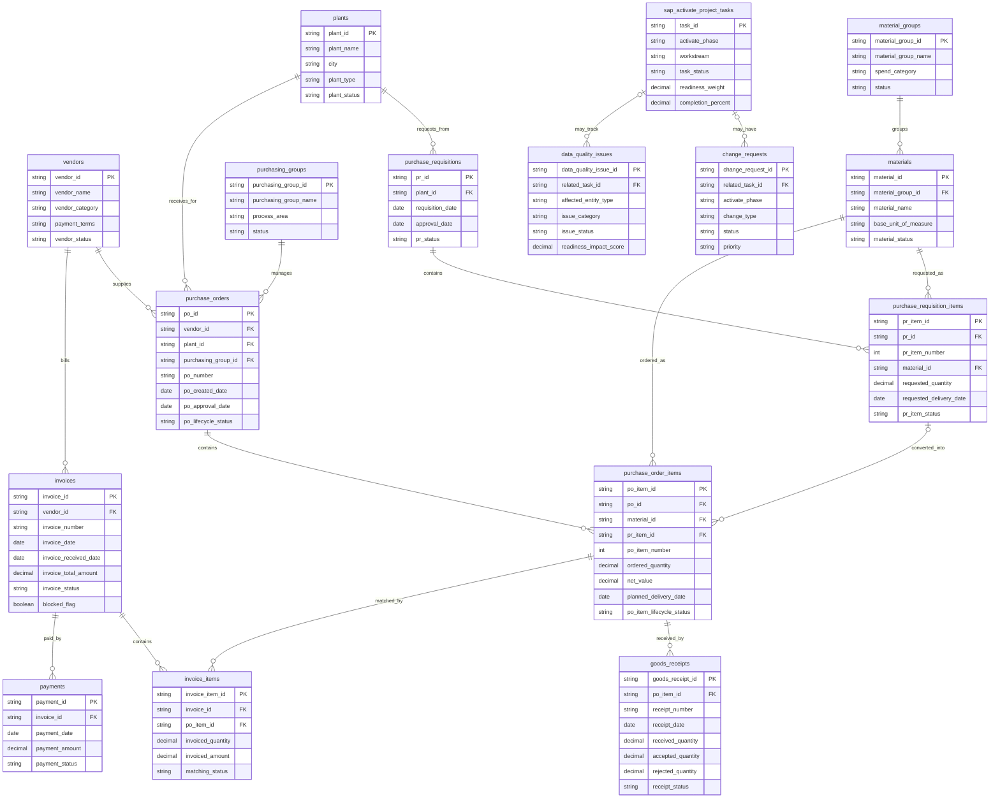

# Data Model

## 1. Purpose

This document describes the current SQLite data model implemented in `database/schema.sql` for the SAP Activate ERP Procurement Analytics project. The model supports deterministic synthetic procurement data, portfolio-ready SQL analytics, and optional future dashboard reporting.

The repository is a simplified analytical simulation for Marmara Components, a fictional company. It does not connect to a live SAP system and does not reproduce the full SAP S/4HANA data model.

## 2. Implementation Status

Implemented:

- 16 persisted SQLite tables.
- Three derived analytical views.
- Deterministic synthetic data generation through Phase 3.
- Master data, purchase requisitions, purchase orders, goods receipts, and SAP Activate project tasks.
- Integrity, foreign-key, lifecycle, fulfillment, delivery-performance, and deterministic regeneration checks.

Tables implemented but currently empty for later phases:

- `invoices`
- `invoice_items`
- `payments`
- `change_requests`
- `data_quality_issues`

Not yet implemented:

- Invoice, invoice item, payment, change request, and data quality issue data generation.
- Separate SQL analytics query files.
- Dashboard assets.

## 3. Design Principles

| Principle | Explanation |
| --- | --- |
| Analytical first | The model supports KPI reporting and process analysis rather than transactional SAP execution. |
| Deterministic simulation | The dataset is synthetic and repeatable with default seed `42`. |
| Explicit transaction grain | Header, item, and event tables have clear grains for reliable KPI logic. |
| Item-level spend and fulfillment | `purchase_order_items` is the main grain for spend, quantity, delivery, and supplier reliability analytics. |
| Stored lifecycle, derived progress | PO and PO-item lifecycle are stored; fulfillment and delivery performance are derived from receipt facts. |
| SQL-friendly structure | The schema uses readable SQLite tables, constraints, foreign keys, and views. |

## 4. Persisted Tables

| Table | Type | Main Purpose |
| --- | --- | --- |
| `vendors` | Master data | Supplier information for spend, delivery, invoice, and payment analysis. |
| `plants` | Master data | Company locations where demand and receipt activity occur. |
| `purchasing_groups` | Master data | Buyer teams or procurement ownership groups. |
| `material_groups` | Master data | Procurement categories for material grouping and spend analysis. |
| `materials` | Master data | Material and service records used on requisition and PO items. |
| `purchase_requisitions` | Transaction header | Internal purchase requests before supplier-facing purchase orders. |
| `purchase_requisition_items` | Transaction item | Requested material, quantity, price estimate, delivery date, and conversion status. |
| `purchase_orders` | Transaction header | Supplier-facing purchasing documents linked to vendors, plants, and purchasing groups. |
| `purchase_order_items` | Transaction item | PO line-level spend, quantity, material, delivery expectation, and lifecycle. |
| `goods_receipts` | Transaction event | Receipt events against PO items for physical receipt, acceptance, rejection, and delivery analysis. |
| `invoices` | Transaction header | Future supplier invoice header records. |
| `invoice_items` | Transaction item | Future invoice lines linked to PO items for matching analysis. |
| `payments` | Transaction event | Future payment records linked to invoices. |
| `sap_activate_project_tasks` | Project tracking | SAP Activate phase tasks, ownership, status, readiness weight, and completion. |
| `change_requests` | Project tracking | Future project scope or requirement changes. |
| `data_quality_issues` | Readiness tracking | Future master-data, transaction-data, and migration-readiness issues. |

## 5. Key Table Details

### `purchase_orders`

Purchase order header table. It stores supplier-facing document information and lifecycle state.

Important columns:

| Column | Description |
| --- | --- |
| `po_id` | Primary key for the purchase order header. |
| `vendor_id` | Foreign key to `vendors`. |
| `plant_id` | Foreign key to `plants`. |
| `purchasing_group_id` | Foreign key to `purchasing_groups`. |
| `po_number` | Unique synthetic purchase order number. |
| `po_created_date` | Date the purchase order was created. |
| `po_approval_date` | Date the purchase order was approved or released. |
| `document_currency` | Three-character currency code. |
| `po_lifecycle_status` | Stored lifecycle state: `active`, `blocked`, `cancelled`, or `closed`. |

`po_lifecycle_status` does not store receipt fulfillment. Fulfillment is derived from accepted goods receipt quantities through SQL views.

### `purchase_order_items`

Purchase order item table. This is the main analytical grain for spend, quantity, delivery, and supplier reliability.

Important columns:

| Column | Description |
| --- | --- |
| `po_item_id` | Primary key for the PO item. |
| `po_id` | Foreign key to `purchase_orders`. |
| `material_id` | Foreign key to `materials`. |
| `pr_item_id` | Nullable foreign key to `purchase_requisition_items`; null means a direct PO item. |
| `po_item_number` | Line number within the PO; unique together with `po_id`. |
| `ordered_quantity` | Ordered quantity. |
| `unit_price` | Purchase order unit price. |
| `net_value` | Item-level spend value. |
| `planned_delivery_date` | Expected delivery date used in delivery KPIs. |
| `po_item_lifecycle_status` | Stored lifecycle state: `active`, `cancelled`, or `closed`. |

Receipt progress and future invoice progress are derived separately. They are not stored as PO-item lifecycle values.

### `goods_receipts`

Goods receipt event table. Each row represents one receipt event for one PO item.

Important columns:

| Column | Description |
| --- | --- |
| `goods_receipt_id` | Primary key for the receipt event. |
| `po_item_id` | Foreign key to `purchase_order_items`. |
| `receipt_number` | Unique synthetic receipt number. |
| `receipt_date` | Date the receipt event occurred. |
| `received_quantity` | Physical quantity received in the event. |
| `accepted_quantity` | Quantity accepted after inspection or validation. |
| `rejected_quantity` | Quantity rejected or returned. |
| `receipt_status` | Workflow-only status: `posted`, `under review`, or `reversed`. |

Status-aware quantity rules:

- `posted` and `reversed` rows must balance `received_quantity = accepted_quantity + rejected_quantity` within floating-point tolerance.
- `under review` rows have received quantity but zero accepted and rejected quantity.
- `reversed` rows are excluded from effective fulfillment calculations.
- `under review` rows count as physically received but not as accepted fulfillment.

Rejected quantity remains open against the order; it does not close the PO item.

### Future Finance and Exception Tables

The current schema includes `invoices`, `invoice_items`, `payments`, `change_requests`, and `data_quality_issues`, but the deterministic generator currently leaves these tables empty. Their structures support later invoice matching, payment analysis, project exception tracking, and readiness analysis.

## 6. Primary Keys and Relationships

| Table | Primary Key | Foreign Keys |
| --- | --- | --- |
| `vendors` | `vendor_id` | None |
| `plants` | `plant_id` | None |
| `purchasing_groups` | `purchasing_group_id` | None |
| `material_groups` | `material_group_id` | None |
| `materials` | `material_id` | `material_group_id` -> `material_groups.material_group_id` |
| `purchase_requisitions` | `pr_id` | `plant_id` -> `plants.plant_id` |
| `purchase_requisition_items` | `pr_item_id` | `pr_id` -> `purchase_requisitions.pr_id`; `material_id` -> `materials.material_id` |
| `purchase_orders` | `po_id` | `vendor_id` -> `vendors.vendor_id`; `plant_id` -> `plants.plant_id`; `purchasing_group_id` -> `purchasing_groups.purchasing_group_id` |
| `purchase_order_items` | `po_item_id` | `po_id` -> `purchase_orders.po_id`; `material_id` -> `materials.material_id`; nullable `pr_item_id` -> `purchase_requisition_items.pr_item_id` |
| `goods_receipts` | `goods_receipt_id` | `po_item_id` -> `purchase_order_items.po_item_id` |
| `invoices` | `invoice_id` | `vendor_id` -> `vendors.vendor_id` |
| `invoice_items` | `invoice_item_id` | `invoice_id` -> `invoices.invoice_id`; `po_item_id` -> `purchase_order_items.po_item_id` |
| `payments` | `payment_id` | `invoice_id` -> `invoices.invoice_id` |
| `sap_activate_project_tasks` | `task_id` | None |
| `change_requests` | `change_request_id` | Nullable `related_task_id` -> `sap_activate_project_tasks.task_id` |
| `data_quality_issues` | `data_quality_issue_id` | Nullable `related_task_id` -> `sap_activate_project_tasks.task_id` |

Delete behavior:

- Required procurement, finance, and master-data relationships use `ON DELETE RESTRICT`.
- Optional references use `ON DELETE SET NULL`, including `purchase_order_items.pr_item_id`, `change_requests.related_task_id`, and `data_quality_issues.related_task_id`.
- Foreign keys use `ON UPDATE CASCADE`.

## 7. Transaction and View Grain

| Object | Grain | Why It Matters |
| --- | --- | --- |
| `purchase_requisitions` | One row per purchase requisition header. | Supports requisition status, approval timing, and demand ownership. |
| `purchase_requisition_items` | One row per requisition line item. | Supports requested material, quantity, and PR-to-PO conversion analysis. |
| `purchase_orders` | One row per purchase order header. | Supports vendor, plant, purchasing group, approval timing, and lifecycle analysis. |
| `purchase_order_items` | One row per purchase order line item. | Main grain for spend, delivery expectation, open quantity, and supplier reliability. |
| `goods_receipts` | One row per receipt event for a PO item. | Multiple receipt events can fulfill one PO item. |
| `invoices` | One row per supplier invoice header. | Future invoice status and payment readiness analysis. |
| `invoice_items` | One row per invoice line matched to a PO item. | Future three-way matching analysis. |
| `payments` | One row per payment event for an invoice. | Future payment timing and completion analysis. |
| `sap_activate_project_tasks` | One row per project task or readiness activity. | Phase, workstream, completion, and readiness scoring. |
| `change_requests` | One row per project change request. | Future scope and requirement change analysis. |
| `data_quality_issues` | One row per data quality or migration-readiness issue. | Future issue count, resolution, and readiness impact analysis. |
| `vw_po_item_fulfillment` | One row per PO item. | Derived item fulfillment and open quantity. |
| `vw_po_fulfillment` | One row per PO header. | Derived header fulfillment from active item statuses. |
| `vw_po_item_delivery_performance` | One row per PO item. | Derived item-level delivery performance. |

## 8. Analytical Views

### `vw_po_item_fulfillment`

Grain: one row per PO item.

This view aggregates receipt facts and derives item fulfillment.

Important output columns:

- `total_received_quantity`
- `total_accepted_quantity`
- `total_rejected_quantity`
- `total_under_review_quantity`
- `open_quantity`
- `fulfillment_status`

Rules:

- Posted accepted quantity drives fulfillment.
- Accepted quantity equal to zero -> `open`.
- Accepted quantity greater than zero and below ordered quantity -> `partial`.
- Accepted quantity greater than or equal to ordered quantity -> `complete`.
- Blocked, cancelled, closed, or other non-active lifecycle combinations -> `NULL`.
- `open_quantity` is calculated as `MAX(ordered_quantity - total_accepted_quantity, 0)`.
- The view uses SQLite scalar `MAX(a, b)` to prevent negative open quantity.

### `vw_po_fulfillment`

Grain: one row per PO header.

This view derives PO header fulfillment from active item fulfillment:

- All applicable active items open -> `open`.
- Some progress but not all active items complete -> `partial`.
- All applicable active items complete -> `complete`.
- Blocked, cancelled, closed, or other non-active header lifecycle states -> `NULL`.

### `vw_po_item_delivery_performance`

Grain: one row per PO item.

This view derives item-level delivery performance from cumulative posted accepted quantity. `fulfillment_date` is the first date on which cumulative posted accepted quantity reaches the ordered quantity.

Deterministic receipt ordering:

1. `receipt_date`
2. `receipt_number`
3. `goods_receipt_id`

Delivery-performance statuses:

- `not fulfilled`
- `on time in full`
- `late in full`
- `NULL` for non-applicable lifecycle states

The reusable view does not contain a reporting-date filter. Reporting queries should apply their own date filter, for example by selecting PO items with `planned_delivery_date` on or before a selected reporting date.

## 9. Relationship and Design Rationale

The model follows a simplified procure-to-pay analytical flow:

- Purchase requisitions represent internal demand.
- Purchase order items may reference requisition items, but direct PO items leave `pr_item_id` null.
- Receipt events connect to PO items.
- Physical received quantity and accepted fulfillment quantity are different facts.
- Rejected quantity remains open against the order.
- PO and PO-item lifecycle are stored.
- Receipt fulfillment is derived from accepted posted quantity.
- Invoice progress will later be derived separately from invoice and invoice item records.

This design keeps delivery reliability, open quantity, document lifecycle, receipt workflow, and future invoice matching logically separate.

## 10. Mermaid ERD

The ERD shows persisted tables only. The derived analytical views are `vw_po_item_fulfillment`, `vw_po_fulfillment`, and `vw_po_item_delivery_performance`.

## 11. KPI Group to Source Object Mapping

| KPI Group | Core KPI | Primary Source Objects | Current Status |
| --- | --- | --- | --- |
| Procurement Spend | Total Procurement Spend | `purchase_order_items`, `purchase_orders` | Planned query file. |
| Procurement Spend | Spend by Vendor | `vendors`, `purchase_orders`, `purchase_order_items` | Planned query file. |
| Procurement Spend | Spend by Material Group | `material_groups`, `materials`, `purchase_order_items` | Planned query file. |
| Procurement Efficiency | Purchase Order Cycle Time | `purchase_requisitions`, `purchase_requisition_items`, `purchase_orders`, `purchase_order_items` | Planned query file. |
| Supplier Performance | PO Item On-Time In-Full Rate | `vw_po_item_delivery_performance`, `purchase_orders`, `purchase_order_items`, `vendors` | Implemented in Phase 3 validation logic. |
| Supplier Performance | Receipt Event On-Time Rate | `goods_receipts`, `purchase_order_items`, `purchase_orders`, `vendors` | Implemented in Phase 3 validation logic. |
| Supplier Performance | Average Delivery Delay | `goods_receipts`, `purchase_order_items`, `vendors` | Implemented in Phase 3 validation logic. |
| Procurement Operations | Open PO Quantity | `vw_po_item_fulfillment` | Implemented in Phase 3 view logic. |
| Invoice and Matching | Invoice mismatch KPIs | `purchase_order_items`, `goods_receipts`, `invoices`, `invoice_items` | Planned for later phases. |
| SAP Activate Readiness | Data readiness and go-live outputs | `sap_activate_project_tasks`, `change_requests`, `data_quality_issues` | Partially modeled; data generation planned for later phases. |
