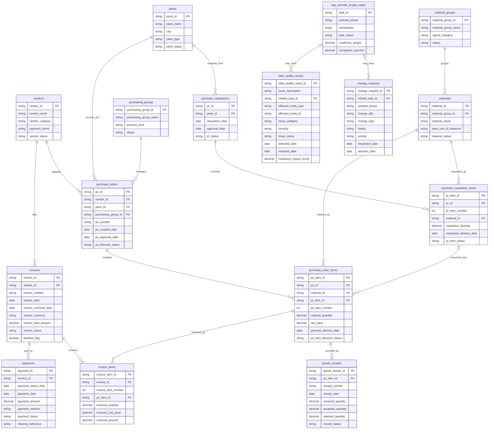

# Data Model

## 1. Purpose

This document describes the current SQLite data model implemented in `database/schema.sql` for the SAP Activate ERP Procurement Analytics project. The model supports deterministic synthetic procurement data, portfolio-ready SQL analytics, and optional future dashboard reporting.

The repository is a simplified analytical simulation for Marmara Components, a fictional company. It does not connect to a live SAP system and does not reproduce the full SAP S/4HANA data model.

## 2. Implementation Status

Implemented:

- 16 persisted SQLite tables.
- Eight derived analytical views.
- Deterministic synthetic data generation through Phase 6.
- Master data, purchase requisitions, purchase orders, goods receipts, invoices, invoice items, payments, SAP Activate project tasks, six change requests, and seven data-quality issues.
- Phase 6 change-request phase summaries and project-readiness analytics.
- Integrity, foreign-key, lifecycle, fulfillment, delivery-performance, invoice matching, blocking, payment-progress, project-readiness, adversarial rollback, and deterministic regeneration checks.

Not yet implemented:

- Separate SQL analytics query files.
- Dashboard assets.

## 3. Design Principles

| Principle | Explanation |
| --- | --- |
| Analytical first | The model supports KPI reporting and process analysis rather than transactional SAP execution. |
| Deterministic simulation | The dataset is synthetic and repeatable with default seed `42`. |
| Explicit transaction grain | Header, item, and event tables have clear grains for reliable KPI logic. |
| Item-level spend and fulfillment | `purchase_order_items` is the main grain for spend, quantity, delivery, and supplier reliability analytics. |
| Stored lifecycle, derived progress | PO and PO-item lifecycle are stored; fulfillment and delivery performance are derived from receipt facts. |
| Independent invoice concerns | Invoice lifecycle and blocking are stored independently; three-way matching is derived from PO, receipt, and invoice facts. |
| Independent payment concerns | Payment rows store instruction or attempt results; invoice payment progress and current eligibility are derived separately. |
| SQL-friendly structure | The schema uses readable SQLite tables, constraints, foreign keys, and views. |

## 4. Persisted Tables

| Table | Type | Main Purpose |
| --- | --- | --- |
| `vendors` | Master data | Supplier information for spend, delivery, invoice, and payment analysis. |
| `plants` | Master data | Company locations where demand and receipt activity occur. |
| `purchasing_groups` | Master data | Buyer teams or procurement ownership groups. |
| `material_groups` | Master data | Procurement categories for material grouping and spend analysis. |
| `materials` | Master data | Material and service records used on requisition and PO items. |
| `purchase_requisitions` | Transaction header | Internal purchase requests before supplier-facing purchase orders. |
| `purchase_requisition_items` | Transaction item | Requested material, quantity, price estimate, delivery date, and conversion status. |
| `purchase_orders` | Transaction header | Supplier-facing purchasing documents linked to vendors, plants, and purchasing groups. |
| `purchase_order_items` | Transaction item | PO line-level spend, quantity, material, delivery expectation, and lifecycle. |
| `goods_receipts` | Transaction event | Receipt events against PO items for physical receipt, acceptance, rejection, and delivery analysis. |
| `invoices` | Transaction header | Supplier invoice lifecycle, currency, totals, and independent blocking information. |
| `invoice_items` | Transaction item | Raw supplier invoice lines linked to PO items. |
| `payments` | Transaction event | Payment instructions or attempts linked to invoices, with successful clearing represented by `paid`. |
| `sap_activate_project_tasks` | Project tracking | SAP Activate phase tasks, ownership, status, readiness weight, and completion. |
| `change_requests` | Project tracking | Deterministic project scope, requirement, process, data, reporting, and integration changes. |
| `data_quality_issues` | Readiness tracking | Deterministic legacy migration and UAT data-quality findings without corrupting source facts. |

## 5. Key Table Details

### `purchase_orders`

Purchase order header table. It stores supplier-facing document information and lifecycle state.

Important columns:

| Column | Description |
| --- | --- |
| `po_id` | Primary key for the purchase order header. |
| `vendor_id` | Foreign key to `vendors`. |
| `plant_id` | Foreign key to `plants`. |
| `purchasing_group_id` | Foreign key to `purchasing_groups`. |
| `po_number` | Unique synthetic purchase order number. |
| `po_created_date` | Date the purchase order was created. |
| `po_approval_date` | Date the purchase order was approved or released. |
| `document_currency` | Three-character currency code. |
| `po_lifecycle_status` | Stored lifecycle state: `active`, `blocked`, `cancelled`, or `closed`. |

`po_lifecycle_status` does not store receipt fulfillment. Fulfillment is derived from accepted goods receipt quantities through SQL views.

### `purchase_order_items`

Purchase order item table. This is the main analytical grain for spend, quantity, delivery, and supplier reliability.

Important columns:

| Column | Description |
| --- | --- |
| `po_item_id` | Primary key for the PO item. |
| `po_id` | Foreign key to `purchase_orders`. |
| `material_id` | Foreign key to `materials`. |
| `pr_item_id` | Nullable foreign key to `purchase_requisition_items`; null means a direct PO item. |
| `po_item_number` | Line number within the PO; unique together with `po_id`. |
| `ordered_quantity` | Ordered quantity. |
| `unit_price` | Purchase order unit price. |
| `net_value` | Item-level spend value. |
| `planned_delivery_date` | Expected delivery date used in delivery KPIs. |
| `po_item_lifecycle_status` | Stored lifecycle state: `active`, `cancelled`, or `closed`. |

Receipt progress and invoice matching are derived separately. They are not stored as PO-item lifecycle values.

### `goods_receipts`

Goods receipt event table. Each row represents one receipt event for one PO item.

Important columns:

| Column | Description |
| --- | --- |
| `goods_receipt_id` | Primary key for the receipt event. |
| `po_item_id` | Foreign key to `purchase_order_items`. |
| `receipt_number` | Unique synthetic receipt number. |
| `receipt_date` | Date the receipt event occurred. |
| `received_quantity` | Physical quantity received in the event. |
| `accepted_quantity` | Quantity accepted after inspection or validation. |
| `rejected_quantity` | Quantity rejected or returned. |
| `receipt_status` | Workflow-only status: `posted`, `under review`, or `reversed`. |

Status-aware quantity rules:

- `posted` and `reversed` rows must balance `received_quantity = accepted_quantity + rejected_quantity` within floating-point tolerance.
- `under review` rows have received quantity but zero accepted and rejected quantity.
- `reversed` rows are excluded from effective fulfillment calculations.
- `under review` rows count as physically received but not as accepted fulfillment.

Rejected quantity remains open against the order; it does not close the PO item.

### `invoices`

Invoice header table. `invoice_status` represents document lifecycle only: `received`, `posted`, `approved`, `disputed`, or `cancelled`. Blocking is stored independently through `blocked_flag` and `block_reason`. Payment state is not stored on the invoice; it is derived from `payments` through `vw_invoice_payment_progress`.

`invoice_currency` must agree with the document currency of every referenced PO. `invoice_total_amount` is the sum of net invoice-item amounts; Phase 4 does not model tax or freight.

### `invoice_items`

Raw invoice-item table. Each row has an item number unique within its invoice, references one PO item, and stores invoiced quantity, unit price, and net amount.

Quantity variance, price variance, and matching status are deliberately not stored in this table. They are derived in `vw_invoice_item_three_way_match` so they cannot drift away from PO, GR, or invoice facts.

### `payments`

Each row represents one payment instruction or attempt and its current or final result for one invoice.

Important columns:

| Column | Description |
| --- | --- |
| `payment_id` | Primary key for the payment instruction or attempt. |
| `invoice_id` | Foreign key to the related invoice. |
| `payment_status_date` | Required date on which the current or final payment status was recorded. |
| `payment_date` | Successful payment or clearing date; populated only when status is `paid`. |
| `payment_amount` | Positive amount denominated in the parent invoice's currency. |
| `payment_method` | Bank transfer, check, card, or other. |
| `payment_status` | `scheduled`, `on hold`, `paid`, `failed`, or `cancelled`. |
| `clearing_reference` | Unique non-empty reference required only for successful payments. |

`partially paid` is not a payment-row status. A successful payment event is `paid` even when it settles only part of the invoice; invoice-level `partially paid` progress is derived by aggregating successful payment amounts.

The table does not store `payment_currency`. Payment amount inherits `invoices.invoice_currency`. FX conversion, settlement currency, exchange rates, refunds, credit memos, and chargebacks are outside Phase 5.

Local row invariants are enforced by schema constraints. Payment chronology, amount arithmetic, and cumulative overpayment are checked as historical fact rules by the deterministic Python generator rather than database triggers. Current invoice eligibility is checked separately only when a payment row is treated as a newly proposed successful payment.

### Project Change and Data-Quality Tables

`change_requests` stores one current-state row per project change request. Its status is independent of `sap_activate_project_tasks.task_status`. Requests in `submitted`, `under review`, or `approved` status are analytically open; approved remains open until implemented. Deferred, rejected, implemented, and cancelled requests are dispositioned.

`data_quality_issues` stores one current-state row per discovered legacy migration or UAT issue. `issue_description` records the concrete business scenario, while `affected_entity_type` and `affected_entity_id` identify the valid deterministic entity associated with the finding. These polymorphic entity references are validated in Python rather than modeled as multiple nullable foreign keys.

Only `resolved` issues have a `resolved_date`. Accepted risk remains separate from resolved and retains a null resolution date. Cancelled issues are excluded from readiness-rate denominators. No change-request approval history or issue history is modeled.

## 6. Primary Keys and Relationships

| Table | Primary Key | Foreign Keys |
| --- | --- | --- |
| `vendors` | `vendor_id` | None |
| `plants` | `plant_id` | None |
| `purchasing_groups` | `purchasing_group_id` | None |
| `material_groups` | `material_group_id` | None |
| `materials` | `material_id` | `material_group_id` -> `material_groups.material_group_id` |
| `purchase_requisitions` | `pr_id` | `plant_id` -> `plants.plant_id` |
| `purchase_requisition_items` | `pr_item_id` | `pr_id` -> `purchase_requisitions.pr_id`; `material_id` -> `materials.material_id` |
| `purchase_orders` | `po_id` | `vendor_id` -> `vendors.vendor_id`; `plant_id` -> `plants.plant_id`; `purchasing_group_id` -> `purchasing_groups.purchasing_group_id` |
| `purchase_order_items` | `po_item_id` | `po_id` -> `purchase_orders.po_id`; `material_id` -> `materials.material_id`; nullable `pr_item_id` -> `purchase_requisition_items.pr_item_id` |
| `goods_receipts` | `goods_receipt_id` | `po_item_id` -> `purchase_order_items.po_item_id` |
| `invoices` | `invoice_id` | `vendor_id` -> `vendors.vendor_id` |
| `invoice_items` | `invoice_item_id` | `invoice_id` -> `invoices.invoice_id`; `po_item_id` -> `purchase_order_items.po_item_id` |
| `payments` | `payment_id` | `invoice_id` -> `invoices.invoice_id` |
| `sap_activate_project_tasks` | `task_id` | None |
| `change_requests` | `change_request_id` | Nullable `related_task_id` -> `sap_activate_project_tasks.task_id` |
| `data_quality_issues` | `data_quality_issue_id` | Nullable `related_task_id` -> `sap_activate_project_tasks.task_id` |

Delete behavior:

- Required procurement, finance, and master-data relationships use `ON DELETE RESTRICT`.
- Optional references use `ON DELETE SET NULL`, including `purchase_order_items.pr_item_id`, `change_requests.related_task_id`, and `data_quality_issues.related_task_id`.
- Foreign keys use `ON UPDATE CASCADE`.

## 7. Transaction and View Grain

| Object | Grain | Why It Matters |
| --- | --- | --- |
| `purchase_requisitions` | One row per purchase requisition header. | Supports requisition status, approval timing, and demand ownership. |
| `purchase_requisition_items` | One row per requisition line item. | Supports requested material, quantity, and PR-to-PO conversion analysis. |
| `purchase_orders` | One row per purchase order header. | Supports vendor, plant, purchasing group, approval timing, and lifecycle analysis. |
| `purchase_order_items` | One row per purchase order line item. | Main grain for spend, delivery expectation, open quantity, and supplier reliability. |
| `goods_receipts` | One row per receipt event for a PO item. | Multiple receipt events can fulfill one PO item. |
| `invoices` | One row per supplier invoice header. | Invoice lifecycle, currency, total, blocking, and header-level matching analysis. |
| `invoice_items` | One row per invoice line linked to a PO item. | Raw quantity, unit price, and amount facts for three-way matching. |
| `payments` | One row per payment instruction or attempt for an invoice. | Stores the attempt result without storing invoice-level payment progress. |
| `sap_activate_project_tasks` | One row per project task or readiness activity. | Phase, workstream, completion, and readiness scoring. |
| `change_requests` | One row per project change request. | Current-state scope, requirement, status, phase, and priority analysis. |
| `data_quality_issues` | One row per data quality or migration-readiness issue. | Current-state issue resolution, accepted-risk, severity, and readiness analysis. |
| `vw_po_item_fulfillment` | One row per PO item. | Derived item fulfillment and open quantity. |
| `vw_po_fulfillment` | One row per PO header. | Derived header fulfillment from active item statuses. |
| `vw_po_item_delivery_performance` | One row per PO item. | Derived item-level delivery performance. |
| `vw_invoice_item_three_way_match` | One row per non-cancelled invoice item. | Derived PO-GR-invoice quantity and price matching. |
| `vw_invoice_matching_summary` | One row per invoice header. | Header-level matching rollup with explicit excluded and invalid states. |
| `vw_invoice_payment_progress` | One row per invoice header. | Successful-payment rollup, current eligibility, outstanding amount, and derived payment progress. |
| `vw_change_request_phase_summary` | One row per SAP Activate phase. | Status, open, and high/critical open change-request counts, including zero-request phases. |
| `vw_project_readiness_summary` | One row for the project snapshot. | Transparent pre-go-live task, change-request, data-quality, rate, and readiness classification outputs. |

## 8. Analytical Views

### `vw_po_item_fulfillment`

Grain: one row per PO item.

This view aggregates receipt facts and derives item fulfillment.

Important output columns:

- `total_received_quantity`
- `total_accepted_quantity`
- `total_rejected_quantity`
- `total_under_review_quantity`
- `open_quantity`
- `fulfillment_status`

Rules:

- Posted accepted quantity drives fulfillment.
- Accepted quantity equal to zero -> `open`.
- Accepted quantity greater than zero and below ordered quantity -> `partial`.
- Accepted quantity greater than or equal to ordered quantity -> `complete`.
- Blocked, cancelled, closed, or other non-active lifecycle combinations -> `NULL`.
- `open_quantity` is calculated as `MAX(ordered_quantity - total_accepted_quantity, 0)`.
- The view uses SQLite scalar `MAX(a, b)` to prevent negative open quantity.

### `vw_po_fulfillment`

Grain: one row per PO header.

This view derives PO header fulfillment from active item fulfillment:

- All applicable active items open -> `open`.
- Some progress but not all active items complete -> `partial`.
- All applicable active items complete -> `complete`.
- Blocked, cancelled, closed, or other non-active header lifecycle states -> `NULL`.

### `vw_po_item_delivery_performance`

Grain: one row per PO item.

This view derives item-level delivery performance from cumulative posted accepted quantity. `fulfillment_date` is the first date on which cumulative posted accepted quantity reaches the ordered quantity.

Deterministic receipt ordering:

1. `receipt_date`
2. `receipt_number`
3. `goods_receipt_id`

Delivery-performance statuses:

- `not fulfilled`
- `on time in full`
- `late in full`
- `NULL` for non-applicable lifecycle states

The reusable view does not contain a reporting-date filter. Reporting queries should apply their own date filter, for example by selecting PO items with `planned_delivery_date` on or before a selected reporting date.

### `vw_invoice_item_three_way_match`

Grain: one row per non-cancelled invoice item.

This view is the single source of three-way matching business logic. It exposes PO quantity and price, eligible accepted goods receipt quantity, cumulative non-cancelled invoiced quantity, invoice quantity and price, quantity variance, unit-price variance, monetary price variance impact, and matching status.

Cancelled invoices are excluded directly from this view. This single eligibility boundary prevents cancelled quantities from entering cumulative invoiced quantity, matched or exception item counts, and the Three-Way Matching Exception Rate denominator.

Eligible accepted quantity is the sum of `accepted_quantity` for the same PO item where:

- `receipt_status = 'posted'`.
- `receipt_date <= invoice_received_date`.

Reversed and under-review receipts do not contribute. The invoice-received-date cutoff prevents a later receipt from retroactively hiding the match state that existed when the invoice was received.

Cumulative invoiced quantity is ordered by:

1. `invoice_received_date`
2. `invoice_id`
3. `invoice_item_number`
4. `invoice_item_id`

`quantity_variance` is cumulative non-cancelled invoiced quantity minus eligible posted accepted quantity. A positive value represents over-invoicing. Zero is an exact quantity match. A negative value means accepted goods are not yet fully invoiced and is not an exception by itself.

`price_variance` is the invoice unit price minus the PO unit price, rounded to two decimals. `monetary_price_variance_impact` multiplies this unit-price variance by the current invoice-item quantity.

Matching precedence:

1. Missing goods receipt.
2. Quantity and price mismatch.
3. Quantity mismatch.
4. Price mismatch.
5. Matched.

### `vw_invoice_matching_summary`

Grain: one row per invoice header.

This view aggregates `vw_invoice_item_three_way_match` and does not repeat item matching logic. It provides total, matched, and exception item counts while keeping every invoice header visible for auditability.

Header matching statuses:

- `excluded`: cancelled invoice; all matching item counts are zero.
- `invalid`: non-cancelled invoice with zero eligible invoice items.
- `matched`: at least one eligible item and no exceptions.
- `exception`: at least one eligible item has a matching exception.

Excluded and invalid headers do not contribute matched-item, exception-item, or Three-Way Matching Exception Rate calculations.

### `vw_invoice_payment_progress`

Grain: one row per invoice header.

The view joins every invoice to `vw_invoice_matching_summary` and aggregates only payment rows where `payment_status = 'paid'`. Failed, cancelled, scheduled, and on-hold amounts contribute zero to successful paid amount.

Important output columns:

- `eligible_for_payment_flag`
- `successful_paid_amount`
- `outstanding_amount`
- `successful_payment_count`
- `latest_successful_payment_date`
- `payment_progress_status`

Current eligibility requires:

- Invoice lifecycle status is `posted` or `approved`.
- `blocked_flag = 0`.
- Invoice matching status is `matched`.
- Outstanding amount is greater than the numeric tolerance.

`eligible_for_payment_flag` means that a new successful payment can be accepted now. A fully paid invoice is therefore not currently eligible even when its lifecycle, matching, and blocking controls otherwise pass.

Payment progress for valid non-cancelled invoices:

- No successful amount -> `unpaid`.
- Successful amount greater than zero and below invoice total -> `partially paid`.
- Successful amount equal to invoice total -> `paid`.

Cancelled or invalid invoices have eligibility flag zero, null outstanding amount, and null payment-progress status. Historical successful payment facts remain visible even if an invoice later becomes blocked, cancelled, or otherwise ineligible; current eligibility does not rewrite payment history.

New-payment acceptance and historical payment-fact validation are separate concepts. Current invoice status, blocking, and matching are checked for newly proposed successful payments. They are not applied retroactively to existing paid rows because invoice, blocking, and matching state history is not modeled. The current invoice header cannot reconstruct eligibility as of a historical payment date.

Outstanding amount is kept at zero rather than becoming negative in the analytical output. Overpayments remain invalid data and are detected by Python business-rule validation.

### `vw_change_request_phase_summary`

Grain: one row per SAP Activate phase.

The view uses all six Activate phases as its reporting spine, so phases with zero requests remain visible. It derives:

- Total and per-status request counts.
- `open_request_count` for `submitted`, `under review`, and `approved`.
- `high_critical_open_request_count` for open high- or critical-priority requests.

Approved requests remain open until implemented. Deferred, rejected, implemented, and cancelled requests are not open.

### `vw_project_readiness_summary`

Grain: one row for the current project snapshot.

The view combines transparent aggregate facts from `sap_activate_project_tasks`, `change_requests`, and `data_quality_issues`. Discover through Deploy tasks are in go-live scope; Run tasks are excluded.

Data-quality rates:

- Resolution Rate = resolved issues / non-cancelled issues.
- Disposition Rate = (resolved + accepted risk) / non-cancelled issues.
- Accepted risk is dispositioned but is not resolved.
- A zero denominator returns null.

Readiness precedence:

1. `not ready`: a critical pre-go-live task is blocked, delayed, or cancelled; or a critical change request is open; or a critical data-quality issue is open/in progress.
2. `at risk`: no not-ready condition exists, but a critical pre-go-live task is incomplete; a high-priority change request is open; a high-severity data-quality issue is unresolved; or a high/critical issue is accepted risk.
3. `ready`: none of the preceding conditions exists.

The deterministic Phase 6 result is `not ready` because `TASK-010` is a blocked critical Deploy task and `DQ-004` is an open critical issue. The existing `TASK-011` is excluded because it is stored in the Run phase.

## 9. Relationship and Design Rationale

The model follows a simplified procure-to-pay analytical flow:

- Purchase requisitions represent internal demand.
- Purchase order items may reference requisition items, but direct PO items leave `pr_item_id` null.
- Receipt events connect to PO items.
- Physical received quantity and accepted fulfillment quantity are different facts.
- Rejected quantity remains open against the order.
- PO and PO-item lifecycle are stored.
- Receipt fulfillment is derived from accepted posted quantity.
- Invoice lifecycle and blocking are stored independently.
- Three-way matching is derived at invoice-item grain and then rolled up to invoice grain.
- Payment instruction results are stored at payment grain.
- Successful payment amounts, outstanding amount, and invoice payment progress are derived at invoice grain.
- Change requests and data-quality issues remain separate current-state project facts.
- Go-live readiness is derived from explicit pre-go-live task, change-request, and data-quality blocker rules.

This design keeps delivery reliability, open quantity, document lifecycle, receipt workflow, invoice matching, blocking, payment-attempt result, current eligibility, invoice payment progress, project changes, data-quality lifecycle, and go-live readiness logically separate.

Phase 4 assumes PO, receipt, and invoice quantities use the material base unit of measure. Unit-of-measure conversion is not implemented. Tax, freight, and business matching tolerances are also outside scope. Generated invoice unit prices use no more than two decimal places. Price comparison uses two-decimal monetary values, and quantity comparison uses floating-point tolerance only.

## 10. Mermaid ERD

```mermaid
erDiagram
    vendors ||--o{ purchase_orders : supplies
    plants ||--o{ purchase_requisitions : requests_from
    plants ||--o{ purchase_orders : receives_for
    purchasing_groups ||--o{ purchase_orders : manages
    material_groups ||--o{ materials : groups
    materials ||--o{ purchase_requisition_items : requested_as
    materials ||--o{ purchase_order_items : ordered_as

    purchase_requisitions ||--o{ purchase_requisition_items : contains
    purchase_requisition_items o|--o{ purchase_order_items : converted_into
    purchase_orders ||--o{ purchase_order_items : contains
    purchase_order_items ||--o{ goods_receipts : received_by
    purchase_order_items ||--o{ invoice_items : matched_by
    vendors ||--o{ invoices : bills
    invoices ||--o{ invoice_items : contains
    invoices ||--o{ payments : paid_by

    sap_activate_project_tasks o|--o{ change_requests : may_have
    sap_activate_project_tasks o|--o{ data_quality_issues : may_track

    vendors {
        string vendor_id PK
        string vendor_name
        string vendor_category
        string payment_terms
        string vendor_status
    }

    plants {
        string plant_id PK
        string plant_name
        string city
        string plant_type
        string plant_status
    }

    purchasing_groups {
        string purchasing_group_id PK
        string purchasing_group_name
        string process_area
        string status
    }

    material_groups {
        string material_group_id PK
        string material_group_name
        string spend_category
        string status
    }

    materials {
        string material_id PK
        string material_group_id FK
        string material_name
        string base_unit_of_measure
        string material_status
    }

    purchase_requisitions {
        string pr_id PK
        string plant_id FK
        date requisition_date
        date approval_date
        string pr_status
    }

    purchase_requisition_items {
        string pr_item_id PK
        string pr_id FK
        int pr_item_number
        string material_id FK
        decimal requested_quantity
        date requested_delivery_date
        string pr_item_status
    }

    purchase_orders {
        string po_id PK
        string vendor_id FK
        string plant_id FK
        string purchasing_group_id FK
        string po_number
        date po_created_date
        date po_approval_date
        string po_lifecycle_status
    }

    purchase_order_items {
        string po_item_id PK
        string po_id FK
        string material_id FK
        string pr_item_id FK
        int po_item_number
        decimal ordered_quantity
        decimal net_value
        date planned_delivery_date
        string po_item_lifecycle_status
    }

    goods_receipts {
        string goods_receipt_id PK
        string po_item_id FK
        string receipt_number
        date receipt_date
        decimal received_quantity
        decimal accepted_quantity
        decimal rejected_quantity
        string receipt_status
    }

    invoices {
        string invoice_id PK
        string vendor_id FK
        string invoice_number
        date invoice_date
        date invoice_received_date
        string invoice_currency
        decimal invoice_total_amount
        string invoice_status
        boolean blocked_flag
    }

    invoice_items {
        string invoice_item_id PK
        string invoice_id FK
        int invoice_item_number
        string po_item_id FK
        decimal invoiced_quantity
        decimal invoiced_unit_price
        decimal invoiced_amount
    }

    payments {
        string payment_id PK
        string invoice_id FK
        date payment_status_date
        date payment_date
        decimal payment_amount
        string payment_method
        string payment_status
        string clearing_reference
    }

    sap_activate_project_tasks {
        string task_id PK
        string activate_phase
        string workstream
        string task_status
        decimal readiness_weight
        decimal completion_percent
    }

    change_requests {
        string change_request_id PK
        string related_task_id FK
        string activate_phase
        string change_title
        string change_type
        string status
        string priority
        date requested_date
        date decision_date
    }

    data_quality_issues {
        string data_quality_issue_id PK
        string issue_description
        string related_task_id FK
        string affected_entity_type
        string affected_entity_id
        string issue_category
        string severity
        string issue_status
        date detected_date
        date resolved_date
        decimal readiness_impact_score
    }
```

The ERD shows persisted tables only. The eight derived analytical views are `vw_po_item_fulfillment`, `vw_po_fulfillment`, `vw_po_item_delivery_performance`, `vw_invoice_item_three_way_match`, `vw_invoice_matching_summary`, `vw_invoice_payment_progress`, `vw_change_request_phase_summary`, and `vw_project_readiness_summary`.

## 11. KPI Group to Source Object Mapping

| KPI Group | Core KPI | Primary Source Objects | Current Status |
| --- | --- | --- | --- |
| Procurement Spend | Total Procurement Spend | `purchase_order_items`, `purchase_orders` | Planned query file. |
| Procurement Spend | Spend by Vendor | `vendors`, `purchase_orders`, `purchase_order_items` | Planned query file. |
| Procurement Spend | Spend by Material Group | `material_groups`, `materials`, `purchase_order_items` | Planned query file. |
| Procurement Efficiency | Purchase Order Cycle Time | `purchase_requisitions`, `purchase_requisition_items`, `purchase_orders`, `purchase_order_items` | Planned query file. |
| Supplier Performance | PO Item On-Time In-Full Rate | `vw_po_item_delivery_performance`, `purchase_orders`, `purchase_order_items`, `vendors` | Implemented in Phase 3 validation logic. |
| Supplier Performance | Receipt Event On-Time Rate | `goods_receipts`, `purchase_order_items`, `purchase_orders`, `vendors` | Implemented in Phase 3 validation logic. |
| Supplier Performance | Average Delivery Delay | `goods_receipts`, `purchase_order_items`, `vendors` | Implemented in Phase 3 validation logic. |
| Procurement Operations | Open PO Quantity | `vw_po_item_fulfillment` | Implemented in Phase 3 view logic. |
| Invoice and Matching | Three-Way Matching Exception Rate and Blocked Invoice Count | `purchase_order_items`, `goods_receipts`, `invoices`, `invoice_items`, `vw_invoice_item_three_way_match`, `vw_invoice_matching_summary` | Implemented in Phase 4 view and validation logic. |
| Payment Progress | Invoice Payment Completion Rate and Outstanding Invoice Amount by Currency | `invoices`, `payments`, `vw_invoice_matching_summary`, `vw_invoice_payment_progress` | Implemented in Phase 5 view and validation logic. |
| SAP Activate Readiness | Change-request risk, Data Quality Resolution Rate, and Go-Live Readiness Classification | `sap_activate_project_tasks`, `change_requests`, `data_quality_issues`, `vw_change_request_phase_summary`, `vw_project_readiness_summary` | Implemented in Phase 6 view and validation logic. |
